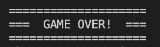

# Higher or Lower Number Guessing Game

Higher or Lower is a Python terminal game. It runs in the Code Institute's mock terminal on Heroku. It is a number guessing game where a random number is generated by the computer and the user tries to guess what it is. The number generated is an integer between 1 and 100 and the user has 5 chances to guess the number correctly. If the user does not guess the number correctly after 5 guesses then they lose the game.

After each guess, the number of remaining guesses will be displayed on the screen. The user is given a hint after each of their guesses as to whether the target number is higher or lower than the last number they have chosen, helping them to make a more accurate guess and to try to win the game.

The main function of this game is to provide the user with a simple number guessing game. It allows the user to have fun and try to guess a random number generated by the computer. 

View the live project here: (**INSERT LIVE LINK HERE**)

(**INSERT SCREEN SHOT HERE FROM AM I RESPONSIVE **)

## How to play the Game

- The game will prompt the user to enter a number between 1 and 100.
- Once the player has entered a guess, the number they have chosen will be checked to see if it matches the target number. 
- If the user's guess and the target number are the same, the user has won the game.
- If the user has guessed incorrectly, they must make another guess. 
- The user has 5 guesses and will be prompted to enter a number for each one.
- If the user does not guess the target number correctly within 5 guesses then they lose the game.

## User Stories

### As a user I would like to see a simple explanation of the game and how to play. 

- Before beginning the game a welcome message is displayed. This provides details of how to play the game to the user. The user is advised that they must choose a number between 1 and 100 and try to guess the target number. The user is also informed that they will have 5 chances in which to guess the correct number. 

- Once the game has started, the user is prompted to provide the required information. The message displayed to the user is "Please choose a number between 1 and 100 (or 999 to exit)". The user is then asked to enter their guess. The user can also quit the game at any poimt by entering 999. 

- When the game is over the user receives a message. The messaging is user-focused as it congratulates the user on winning, and also provides a sympathetic message if the user loses the game. 

### As a user I would like to enter my name at the welcome screen

- Below the initial welcome message the user is asked to enter their name. Once the user enters their name, a messasge is displayed in the terminal welcoming that person to the game using the name/username that they have entered. The user's name is also used in the congratuliations message if they win the game or the message that displays when they lose the game. This adds a more personal touch to the game for the user. 

- The user can enter a name/username of their choice. The name is not limited to strings to allow users to enter a username which may contain words, numbers or a combination of both.

### As a user I would like participate in the game and to enter a guess 

- The user can participate in the game and make a guess by following the prompts on screen. Initially a message is printed on screen to advise the user that they must guess a number between 1 and 100. The message displayed is "Please choose a number between 1 and 100 (or 999 to exit)". The user is then prompted to enter their guess after "Enter number:". Once the user has made their guess, this will be checked to see if it matches the target number. 

- If the user has guessed the correct number a congratulations message will display on screen. This message will include the user's name. It lets them know that they have chosen the correct number and have won the game.

- If the user has not guessed correctly they will be prompted to make another guess. If the correct number is not guessed this will continue until the user has used up all 5 guesses. 

### As a user I would like to see my remaining guesses clearly displayed. 

- When a user enters a guess, the guess is evaluated. In the beginning of the game, the user starts with 5 guesses. After each incorrect guess, the number of remaining guesses is reduced by one. These are displayed on the screen and represented by the letter 'X'. Text above reads "Remaining Guesses" letting the user know that each 'X' represents a the number of guesses they have left. 

### As a user I would like to see if my guess is correct or not

- After a guess is made by the user and the guess has been evaluated text is displayed in the terminal. This advises the user if their guess was correct and they won or if it was incorrect. It also gives the user a hint to make it easier to narrow down where the correct answer might be. If the users guess is incorrect they are prompted to make another guess. 

### As a user I would like to see if the correct answer is higher or lower than my guess

- When a user enters their guess, a message is displayed to the user stating whether the correct answer is higher or lower than their guess. This gives the user a hint they can use in choosing what their next guess might be.  

- The messages are:
    - "Unlucky! The correct answer is Higher"
    - "Unlucky! The correct answer is Lower"

### As a user I would like to know when the game is over and what the correct number was

- Once the user has made 5 incorrect guesses the game will end. A "GAME OVER!" message is displayed on the screen. A message is also displyed to the user, including their name which includes what the correct number was. 

## Flow Chart - Game Data Flow

- I have created a flow chart using Lucidchart.com. I used this in planning my project to represent the game data flow. 

**Screenshot of Game Data Flow:**
<h3 align="center"></h3>

## Existing Features

### Welcome Message and Game Explanation

- An initial welcome message is displayed to the user. This welcomes the user to the game and below the user is given a brief description of how to play the game. The user must try to guess a target number between 1 and 100. The user has a maximum number of 5 guesses in which to guess the correct answer. 

    - **Welcome message displayed:** 

    - "Welcome!
    - To play the game, choose a number between 1 and 100
    - You have 5 chances to guess the target number"

**Screenshot of the Welcome Message displayed in the terminal:**
<h3 align="center"></h3>

### Allow User to enter Username

Below the welcome message a prompt is displayed for the user to enter a name. This is displayed in a personalised message to the user once a name has been provided. The name may contain letters, numbers or a mixture of both and has not been limited to strings. This enables the user to enter whatever name they choose as they might want to use something other than their own name for the game. 

If the user does not want to enter a name they can still proceed to playing the game. By pressing enter, they can begin the game.

**Screenshot of user's name displayed:**
<h3 align="center"></h3>

**Screenshot of terminal if user's name was not entered:**
<h3 align="center"></h3>

### Python Random Library

- The Python random library is imported and used to generate the target number that the user tries to guess

### Accept user input

- The application allows the user to enter a number which will be used as their guess. They can enter up to 5 guesses. If after 5 guesses they have not chosen the correct number they lose the game. 

- User input is also accepted in the form of a username that can be entered by the user
 
### Input validation and error checking

- Once a guess has been entered by the user it is validated. There are a number of checks to ensure that the correct information has been entered.

**Validation for checking if the user input is an integer**

- The input is checked to ensure that an integer is chosen. If the user enters a guess that is not an integer this guess is not accepted and an error message will display. This entry will not count towards the users 5 guesses. 

    - Error message displayed: "Invalid input. Your guess must be a whole number"

**Screen shot of error message when user enters a number with a decimal point:**
<h3 align="center"></h3>

**Screen shot of error message when user enters a number with a string:**
<h3 align="center"></h3>

**Screen shot of error message when user enters a number with a negative number:**
<h3 align="center"></h3>

**Validation to check if the user input is within the specified range**

- The input is also validated to ensure that the user does not enter a number that falls outside the specified range. The range for this game is between 1 and 100. If the user inputs a number outside of this range, an error message will display. This entry will not count towards the users 5 guesses. 

- Error message: "The number you entered was outside the range 1 to 100"

**Screen shot of error message when user enters a number above the maximum number in range (100):**
<h3 align="center"></h3>

**Screen shot of error message when user enters a number below the minimum number in range (1):**
<h3 align="center"></h3>

**Validation for an empty input**

- If the user presses the enter key without inputting any data, an error message will display. This entry will not count towards the users 5 guesses. 

 Error message: "Invalid input. Your guess must be a whole number"

**Screen shot of error message when user does not enter any number:**
<h3 align="center"></h3>

### Display Hints for Incorrect Guesses - Higher or Lower

- Once a user has made a guess it will be checked against the target number. If the user guess is lower than the target number, a message will be displayed to advise the user that their guess was too low so that they will know that they should choose a number with a higher value when making their next guess. 

- Message displayed if user's guess is lower than the target number: "Unlucky! The correct answer is Lower"

**Screenshot of message in the terminal when user's guess is lower than the target number:**
<h3 align="center"></h3>

- If the user guess is higher than the target number, a message will be displayed to advise the user that their guess was too high so that they will know that they should choose a number with a lower value when making their next guess.

- Message displayed if guess the target number is higher than the user's guess: "Unlucky! The correct answer is Higher:

**Screenshot of message in the terminal when user's guess is higher than the target number:**
<h3 align="center"></h3>

### Display Remaining Guesses

- In each game the user can make 5 guesses to try to guess the correct number. These are displayed on screen and represented visually with an 'X'. For example, if there are three remaining guesses then three X's will be displayed on the screen. As each guess is taken, the number of remaining guesses will decrease. Text is displayed above advising that the X's represent remaining guesses.

**Screenshot is remainicng guesses displayed on screen:**
<h3 align="center"></h3>

### Exit Game Option

- Once the game has started the user can exit the game at any point. to do this, they must enter the number 999. When the user types in the keys 999, the game ends and "GAME OVER!" is displayed on screen. The user is also advised of what the target number was for the game. 

**Screen shot of exit information displayed during the game:**
<h3 align="center"></h3>

**Screenshot of "GAME OVER" message once user has exited the game:**
<h3 align="center"></h3>

### Winning/ Losing Message

- Once the user inputs a guess, the guess is checked to see if it matches the target guess. 

- If the guess is correct a winning message is displayed on the screen. This message advises the user that they have won. It displays the username that was entered by the user at the beginning and confirms what the correct number was. 

Example of Winning Message: "Congratulations Dani, you win! The correct number was 98"

**Screenshot of You Win message:**
<h3 align="center"></h3>

**Screenshot of winning message:**
<h3 align="center"></h3>

- If the user has not guessed the correct answer after 5 guesses they lose the game. A message is displayed to advise the user that the game is over abd they have lost the game. It displays the username that was entered by the user at the beginning and confirms what the correct number was. 

Example of Losing Message: "Oh no! Sorry Dan, you have lost the game. The correct number was 57"

**Screenshot of Game Over message:**
<h3 align="center"></h3>

**Screenshot of Losing Message:**
<h3 align="center"></h3>

### Data Maintained in Class Instances

- The game status is maintained within a game status class and by calling the functions within the class (add function names here) the status of the game is maintained and displayed tp the user.

## Future Features

In future I would like to add some additional features to this game:

1. I would like to make it possible for the user to select different levels of difficulty before beginning to play the game. The user would be able to choose from Easy, Intermediate or Difficult. As the levels become more difficult the range of numbers could increase and/ or the number of available guesses could decrease as the levels go from easy to difficult. 

2. I would also like to ask the user if they want hints to be included when playing the game or not. Currently these are displayed and the user does not have a choice. I would like to add this in as a feature in future where users would be able to choose if the want hints or not which would make the number guessing game more challenging. 

3. I would also like to add the option for the user to restart the game immediately after finishing a game without having to run the program again. With the way the game is currently coded, it would require a restructure of the existing code to move all of the game functionality within a class and a new instance of the class would be called to re-start the game.

### Technologies Used

- Lucidchart

    - Lucidchart was used to create a Flow Chart used to visually represent the game data flow and was used in the planning stages of this project.

- Am I responsive

    - Am I responsive was used to take screenshots of the page.

- Heroku 

    - Heroku was used to deploy this project.

- Github

    - Github was used to create and store the project repository.

- Gitpod

    - Gitpod was used to code the project and create my files.

### Languages Used

- Python

    - This game has been created using the Python programming language

### Libraries Used

- import random

    - I used the import random library in Python to generate a random number that was used in the game as the target number the user must try to guess. 

## Testing:

### Functionality & Features

- I played the game numerous times and confirmed that the game runs correctly.
- I confirmed that the welcome message displays correctly.
- I confirmed that the user's name is displayed as entered. 

- I confirmed that the numeber of remaining guesses decreases correctly.

- I confirmed that the number of guesses remaining displays on the screen.

- I confirmed that the game ends after 5 incorrect guesses. 

- I confirmed incorrectly entered input is not counted as part of the users 5 guesses. 

- I confimed the user validation works correctly.

- I confirmed that a message displays after each user guess to confirm if the target number is higher or lower than the user's guess.

- I confirmed the winning message displays correctly.

- I confirmed the losing message displays correctly. 

- I confimed the user validation works correctly.

### Validator Testing

- I tested my Python code in PEP8online.com and no errors were returned. 

(**ENTER SCREENSHOT OF PEP8**)

## Bug Fixes

The following bugs were found when testing:

- Return 0 from get_player_guess function when guess is not an integer

    - During development, I carried out testing to validate the user input for the guess. In order to be able to check that the guess was a number within the range 1 to 100, it was necessary to validate that the input was an integer.
    If the user entered anything other than an integer, nothing was being returned and therefore the subsequent check that the number was within the 1 to 100 range was breaking.
    To enable the check that the number is in range, I set the returned value in the error state to be 0, a number outside of the range of 1 to 100.

    - Bug Fix Commit: 

        - https://github.com/DanielleDaly/milestone-project-3-python/commit/b36b14db3291583a9d215e608ae1246bf2c6a106

- Update handling of guesses outside 1 to 100 range

    - During testing I noticed that using 0 as the default return when the user entered a non-integer was resulting in some display messages not being shown. This was occurring for negative and decimal numbers.
    I made a decision that using a more appropriate error code would work better here. The decision made was to use 422 as the returned number. I chose this number for the following reasons.

        - It is the HTTP Response Code for an [Unprocessable Entity](https://developer.mozilla.org/en-US/docs/Web/HTTP/Status/422), which is generally used when the data sent in a HTTP request is not of an incorrect content type, but it is not possible to process the data.

        - It is a number outside thee range of 1 to 100 and was unlikely to be entered as a guess by the user.
    
    - Bug Fix Commit:

        - https://github.com/DanielleDaly/milestone-project-3-python/commit/fdbdc3063191661553d299c217a99acc861b969c

- Change '==' to 'is' in guess_in_range if statement

    - When I checked the linter for the guess_in_range function I noticed a warning about the use of '==' in the if statement for the comparison against 'True'. The recommendation was to change this to use the 'is' keyword instead. 

    - Bug Fix Commit:

        - https://github.com/DanielleDaly/milestone-project-3-python/commit/5a5605a244dd9b6eef0874d25fd6203d8bf9af78

### Unfixed Bugs

There are no remaining unfixed Bugs

## Deployment

### Github, Gitpod, Git and Heroku

### Github and Gitpod
- I used Github and Gitpod to begin creating this number guessing game.
- I used the Code Institute Template in Github.

**ADD SCREENSHOT FOR CODE INSTITURE TEMPLATE**

After I located the correct template, I clicked on the use this template button.

**ADD SCREENSHOT**

I named the repository "milestone-project-3-python" and created the repository.

**ADD SCREENSHOT**

Once the repository was created I opened it on Gitpod.

I used the terminal to start coding.

### Git

I used git to save my progress throughout this project. 

After I completed each section, I used git add command to add any changes that I had made.

**ADD SCREENSHOT**

I then used the git commit command to commit these changes.

**ADD SCREENSHOT**

These were pushed to Github using git push command.

**ADD SCREENSHOT**

### Heroku

The project was deployed using the Code Insitute's mock terminal for Heroku.

**Steps for Deployment:**

- Fork or clone this repository
- Create a new Heroku App
- Set the buildbacks to Python and Nodejs in that order
- Link the Heroku app to the repository
- Click on Deploy

**Create a new Heroku App**

Sign in to Heroku.com and followed the below steps:

- On the Heroku app, click the "Create New App" button
- Enter the name of your project under "App Name". Each app name must be unique
- Select your region in the space provided under "Choose a region". I selected Europe
- Click the "Create App" button

(**ADD SCREENSHOT**)

**Set the buildbacks to Python and Nodejs**
- Once you click on the "Create App" button you will be brought to another page to set up the app.
- Click on the "Settings" tab at the top of the page
- Scroll down to the "Buildpacks" section
- Click the "Add buildpack" button
- Select "Python" and click on the "Save changes" button
- Select "nodejs" and click on the "Save changes" button
- Make sure the buildpacks are entered in the correct order with Python first and nodejs second. Click and drag them to change the order if required

**Link the Heroku app to the repository**
- Click the connect to github buttton.
- Add project repository name
- Search for repository
- Once located click on the connect button
- Click the setting button
- Click on the reveal config variables button
- Add your config variable key values to this section

**Click on Deploy**

- Click on the "Deploy" tab at the top of the page 
- Scroll down to the "Deployment method" section
- Click on "Github"
- Search for repository by entering the repository name and clicking on the - - - "Search" button
- Click on the "connect" button to link the Heroku app to the Github repository code
- Click on "Manual deploy"
- Under "Choose a branch to deploy" ensure it is set to master and click on the "Deploy Branch" button
- Once the message "Your app was successfully deployed" appears click on the "View" button

## Credits

- Code Institute for the deployment terminal

